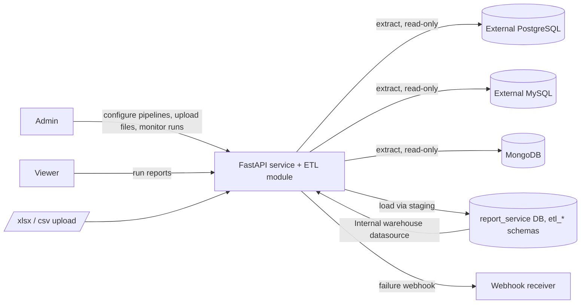
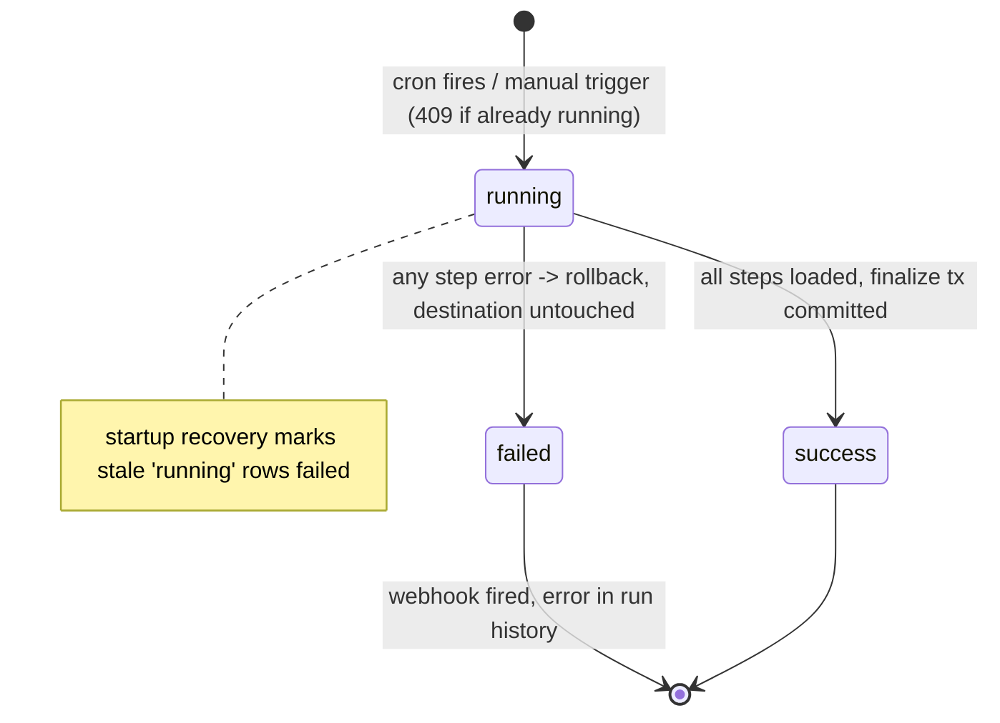

# SRS: ETL Module (brief)

**Version 1.0 · July 2026 · Status: draft**
**Based on:** ETL — Vision & Scope, ETL Solution plan, 3 rounds of PM-Researcher ↔ Architect ↔ BA review (dlt, Airbyte, Meltano/Singer, APScheduler evidence)
**Notion copy:** https://app.notion.com/p/391222dc040c8165bac4e6e6f5870570

## 1. Purpose & business context

- Paystep Analytics today reads live from external Postgres only; data in MySQL, MongoDB, and Excel/CSV files cannot be combined into one report
- The ETL module embeds data integration into the existing FastAPI service — no extra infrastructure, per the product's operational-simplicity goal
- Multi-source pipelines consolidate heterogeneous data into report-ready tables in the service's own `report_service` database
- Loaded tables become instantly reportable through the existing reporting engine via a seeded internal datasource
- Design is validated against peer tools: dlt, Airbyte, Meltano/Singer converge on the same staging, typing, and evolution patterns adopted here
- Consistency guarantee is a first-class business goal: a destination table is never left half-updated

## 2. Scope

- **In:** sources Postgres/MySQL (SQL query), MongoDB (collection + filter/projection), uploaded .xlsx/.csv (snapshot at upload)
- **In:** multi-source ordered pipeline steps into one destination table; per-step column mapping (select, rename, cast only)
- **In:** load modes `full_refresh` and `upsert`; additive schema evolution; cron scheduling + manual trigger; run history; admin-only API; failure webhook
- **Out:** transformations (joins, aggregations, computed columns, filters) — the "T" stays in SQL reports
- **Out:** destinations other than the service's own DB; streaming/CDC; parallel step execution; distributed workers; admin UI (follow-up phase)
- **Out:** source-delete propagation in upsert mode (documented limitation — peer standard; use full_refresh when deletes matter)
- **Out:** email alerting (webhook + in-app status only in v1)

## 3. System context

- Single process, single node: the ETL engine runs inside the existing FastAPI service as asyncio tasks
- External source databases are accessed strictly read-only
- Destination is a set of per-pipeline schemas (`etl_<pipeline_slug>`) inside `report_service` — schema separation prevents table-name collisions (Airbyte namespace / dlt dataset pattern)
- Reports reach loaded tables through a seeded read-only "Internal warehouse" datasource — pipelines and reports stay decoupled
- The in-process scheduler is leader-elected via a Postgres advisory lock; `workers=1` is a documented deployment constraint
- Optional per-pipeline webhook is the only outbound integration

## 4. Reuse analysis

- **Reuse as-is:** JWT auth + `require_admin` guard; `{"detail"}` error contract; `/api/v1/admin/*` conventions; Alembic + async SQLAlchemy for metadata tables; BRD + `static/index.html` docs workflow; startup lifecycle in `main.py` as the scheduler hook
- **Reuse as-is:** existing secret-encryption approach for source credentials (never returned by API)
- **Extend:** `scripts/export.py` gains pipelines + ETL sources (secrets exported encrypted)
- **Extend:** existing `Datasource` records usable directly as Postgres ETL sources
- **Build new:** connector layer (MySQL, MongoDB, file parsers), staging loader, run engine, scheduler gate — `DatasourceManager` is Postgres-only with report-serving timeouts, wrong regime for ETL extraction
- **Build new:** ETL source config model — per-type Pydantic-validated JSON config + encrypted secret fields

## 5. Use cases (primary actor: Admin)

- UC-1 Configure a source: create/test Postgres, MySQL, MongoDB source or upload an xlsx/csv file (snapshot ingested at upload)
- UC-2 Compose a pipeline: ordered steps (source + extract query/config + column mapping), destination table, load mode, upsert keys, cron
- UC-3 Run a pipeline manually and watch per-step progress; second concurrent trigger is rejected (409)
- UC-4 Scheduled run executes unattended; on failure the destination is untouched and the webhook fires
- UC-5 Inspect run history: status, timings, rows extracted/loaded per step, precise error (including offending column on type conflict)
- UC-6 Source schema changed: new column auto-appears in destination; incompatible retype fails the run with clear diagnostics for admin intervention
- UC-7 Viewer (indirect): runs an existing report over loaded tables via the Internal warehouse datasource
- UC-8 Reconfigure/disable a pipeline; scheduler re-syncs jobs without restart

## 6. Functional requirements

- FR-1 Admin CRUDs pipelines with 1..N ordered sources and exactly one destination table in the pipeline's `etl_<slug>` schema
- FR-2 Each step defines a column mapping: select, rename, cast to one of the canonical types; unmapped columns are excluded
- FR-3 A run is atomic: extract to staging, finalize in one short transaction (`full_refresh` = TRUNCATE + INSERT..SELECT; `upsert` = INSERT .. ON CONFLICT by mandatory user-selected keys); any failure leaves the destination unchanged
- FR-4 Upsert rejects rows with NULL key values (fails the run); upsert never deletes rows absent from the source
- FR-5 Schema evolution is additive: new mapped columns auto-ALTER ADD; dropped source columns are kept and filled with NULL; incompatible retype fails the run with a per-column error
- FR-6 Per-pipeline cron scheduling; file-only pipelines are manual-run only; at most one concurrent run per pipeline
- FR-7 Every run is recorded (trigger, status, timings, per-step row counts, error text, schema changes); retention = max(last 50 runs, 30 days); optional failure webhook POSTs run JSON
- FR-8 A seeded read-only "Internal warehouse" datasource exposes ETL schemas to the existing report engine; all ETL endpoints are admin-only

## 7. Non-functional requirements

- NFR-1 Volume: target ≤ 5M rows per run; extraction streams in ~10k-row batches, ~50 MB in-flight cap
- NFR-2 Duration: typical run < 10 min; hard run timeout 60 min (configurable); per-extract-query timeout 10 min
- NFR-3 Availability of the API during runs: DB I/O is native-async; file parsing offloaded to threads in bounded (≈1 s) chunks so report latency is not starved
- NFR-4 Consistency: finalize transaction is short (staging pattern); destination table OID is stable (no rename-swap), so pooled prepared statements and dependent views survive runs
- NFR-5 Security: source credentials encrypted at rest, never returned by any endpoint; external DB access read-only; parameterized queries only
- NFR-6 Reliability: interrupted runs (process crash) are marked failed at startup; scheduler never double-fires (advisory-lock leader election)
- NFR-7 Observability: every failure is diagnosable from run history alone (step, row counts, column-level type errors)
- NFR-8 Maintainability: connector interface allows a new source type as one new module without touching the run engine

## 8. Data & interfaces

- New metadata tables: `etl_sources` (type + Pydantic-validated JSON config + encrypted secrets), `etl_pipelines`, `etl_pipeline_steps` (order, extract config, mapping), `pipeline_runs` (+ per-step stats)
- Canonical type set (Airbyte-style): text, bigint, double precision, numeric, boolean, date, timestamptz, time, jsonb, bytea; Mongo nested docs/arrays → jsonb; file cells inferred into the same set with text fallback
- Admin API under `/api/v1/admin/etl/`: sources CRUD + test + file upload (multipart), pipelines CRUD + steps + run trigger, runs list/detail; errors follow `{"detail"}` with 400/401/403/404/409/504
- Destination DDL is generated from mapped canonical types; staging tables live alongside and are dropped after finalize
- Failure webhook payload: pipeline id/name, run id, status, error text, timings (JSON POST)
- `scripts/export.py` includes ETL config in the FK-safe export

## 9. Run lifecycle (state model)

## 10. Assumptions, limitations & open questions

- Assumption: source DBs reachable from the service host; daily-batch volumes fit the single-node model
- Assumption: `workers=1` deployment; scaling beyond requires extracting a worker process (explicit future step, not v1)
- Limitation: upsert does not propagate source deletes — use full_refresh when delete fidelity matters (peer-standard; documented to admins)
- Limitation: incompatible source type change halts the pipeline until an admin intervenes; remedy is a full refresh re-sync
- Limitation: uploaded files are static snapshots; stale-data risk is owned by the uploading admin
- Open: cross-pipeline joins in reports require qualifying `etl_<slug>` schema names — naming convention must be documented for report authors
- Open: exact webhook retry policy (fire-once vs retries) — decide during implementation planning
- Residual risk: schema-per-pipeline growth (many schemas) is cosmetic at expected pipeline counts (<50)
